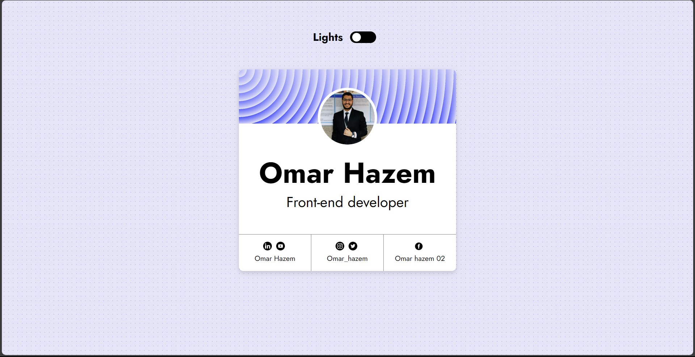

# 🌟 Personal Card Project

This is a **Personal Card Website** I built using **HTML & CSS**.  
The project focuses on creating a **clean, responsive design** with smooth **animations** and an interactive **toggle button**.

## 🚀 Features
- 📱 Fully responsive design  
- ✨ Smooth animations  
- 🔘 Toggle button (for interaction)  
- 🎨 Minimal and modern UI  

## 🛠️ Built With
- HTML  
- CSS
- Grid & Flexbox

## 🎓 Acknowledgment
A big thank you to **[Almdrasa](https://almdrasa.com/)** and **Eng. Mohamed Abusrea** for their guidance and support in my learning journey.  

## 🌐 Live Demo
👉 [Click here to view the project](https://omarhazem02.github.io/Personal-card/)

## 📷 Preview

---
⭐ Feel free to star this repo if you like it!
